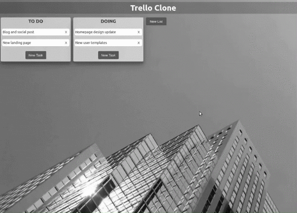
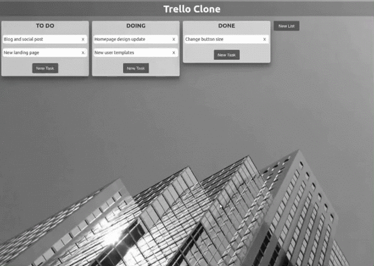

# REACT-KANBAN-APP with React class

## Table of Contents
1. [General Info](#General-Info)
2. [Screenshots](#Screenshots)
3. [Technologies](#Technologies)
4. [Installation](#Installation)
5. [Collaboration](#Collaboration)
6. [License](#License)


## General Info
***
React application with class method and Redux to use the Kanban workflow system. It allows creating and deleting boards and cards, as well as moving them by drag and drop. Based on the Trello model.

Redux allows to manage the app’s state and kept it in a store, and each component can access any state that it needs from this store. Actions are sent using the `store.dispatch()` method and Reducers take the current state of an application, perform an action, and return a new state.

### Features
- Add card
- Add Board
- Delete card
- Delete card
- Drag and drop card onto same board
- Drag and drop card to another board
- Drag and drop board


## Screenshots
***




## Technologies
***
A list of technologies used within the project:
* [React](https://reactjs.org/): Version 17.0.2 
* [React-router-dom](https://www.npmjs.com/package/react-router-dom): Version 5.2.0
* [Redux](https://redux.js.org/): Version 4.0.5
* [React-redux](https://react-redux.js.org/): Version 7.2.2
* [React-beautiful-dnd](https://www.npmjs.com/package/react-beautiful-dnd): Version 13.1.0

## Installation
***
A little intro about the installation: 
```
$ git clone https://github.com/pardo30/trello_clone.git
$ cd ../path/to/the/file
$ npm install
$ npm start
```

## Collaboration
***
Pull requests are welcome. For major changes, please open an issue first to discuss what you would like to change.

Please make sure to update tests as appropriate.

## License
***
This app is released as open source under the terms of the [MIT License](https://choosealicense.com/licenses/mit/)
~~~
Copyright 2021 Pardo30

Permission is hereby granted, free of charge, to any person obtaining a copy of this software and associated documentation files (the "Software"), to deal in the Software without restriction, including without limitation the rights to use, copy, modify, merge, publish, distribute, sublicense, and/or sell copies of the Software, and to permit persons to whom the Software is furnished to do so, subject to the following conditions:

The above copyright notice and this permission notice shall be included in all copies or substantial portions of the Software.

THE SOFTWARE IS PROVIDED "AS IS", WITHOUT WARRANTY OF ANY KIND, EXPRESS OR IMPLIED, INCLUDING BUT NOT LIMITED TO THE WARRANTIES OF MERCHANTABILITY, FITNESS FOR A PARTICULAR PURPOSE AND NONINFRINGEMENT. IN NO EVENT SHALL THE AUTHORS OR COPYRIGHT HOLDERS BE LIABLE FOR ANY CLAIM, DAMAGES OR OTHER LIABILITY, WHETHER IN AN ACTION OF CONTRACT, TORT OR OTHERWISE, ARISING FROM, OUT OF OR IN CONNECTION WITH THE SOFTWARE OR THE USE OR OTHER DEALINGS IN THE SOFTWARE.
~~~